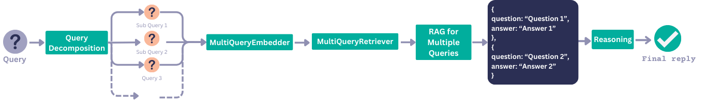
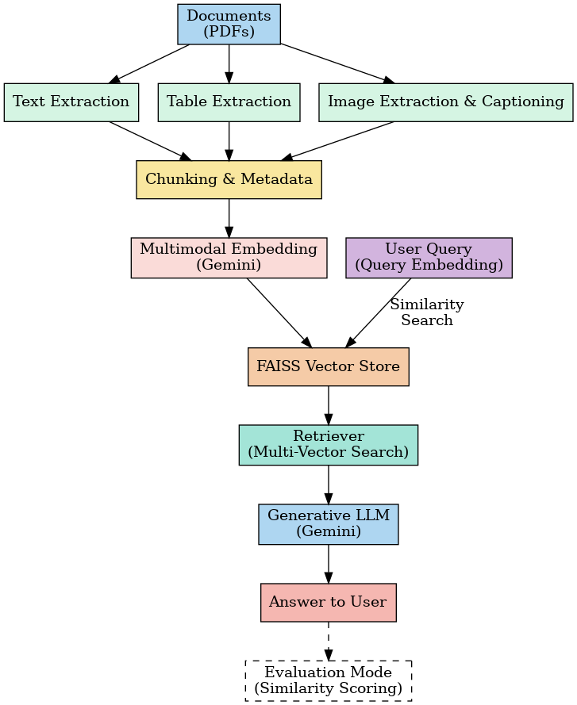

"""
# Multimodal PDF RAG System

A complete Retrieval-Augmented Generation (RAG) system that processes PDFs to extract text, images, and tables, then allows you to ask questions about the content using natural language.

## Features

- **Text Extraction**: Extracts and chunks text from PDF pages


- **Image Processing**: Extracts images and generates captions using Gemini Vision


- **Table Extraction**: Extracts tables and converts them to structured format


- **Semantic Search**: Uses sentence transformers for embedding and FAISS for vector search


- **Query Decomposition**: Breaks complex multi-part questions into simpler sub-queries and answers them iteratively.



- **Multimodal QA**: Answers questions based on a combination of text, image, and table content.

- **Image Rendering in Answers**: Automatically displays relevant extracted images alongside generated answers for visual context.

- **Web Interface**: User-friendly Streamlit interface



## Setup

1. **Install Dependencies**:
   ```bash
   python run.py --install
   ```

2. **Get Google Gemini API Key**:
   - Go to [Google AI Studio](https://makersuite.google.com/app/apikey)
   - Create a new API key
   - Copy the API key

3. **Run the Application**:
   ```bash
   python run.py
   ```

4. **Open Browser**:
   - Go to http://localhost:8501
   - Enter your Gemini API key
   - Upload PDF files and start asking questions!
  
  ## Usage

1. **Upload PDFs**: Use the sidebar to upload one or more PDF files
2. **Process**: Click "Process PDFs" to extract and index content
3. **Ask Questions**: Type questions about your documents in natural language
4. **Get Answers**: The system will retrieve relevant content and generate answers


User Interface

"""
